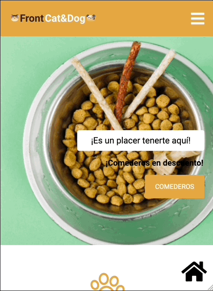

# Pet Shop

Sitio web responsivo

Tecnologías aplicadas:

✅ HTML

✅ CSS

✅ Git

## **Descripción del proyecto**

✅ Sitio web responsivo maquetado siguiendo el modelo indicado.

✅ Se importaron librerias de tipografía Google Fonts.

## **Vistas del proyecto**

### **Versión desktop**

### **Versión mobile**

